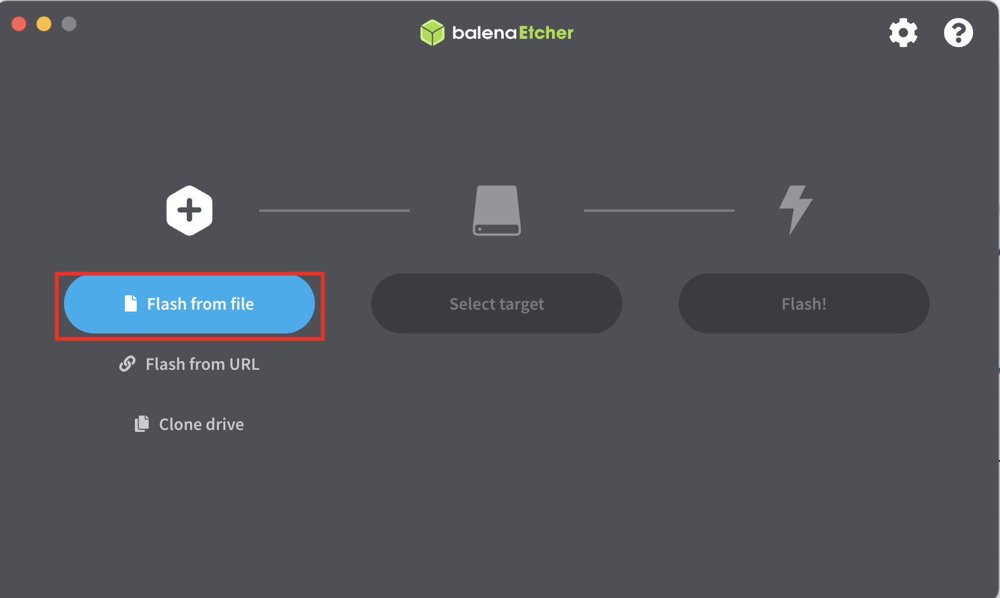
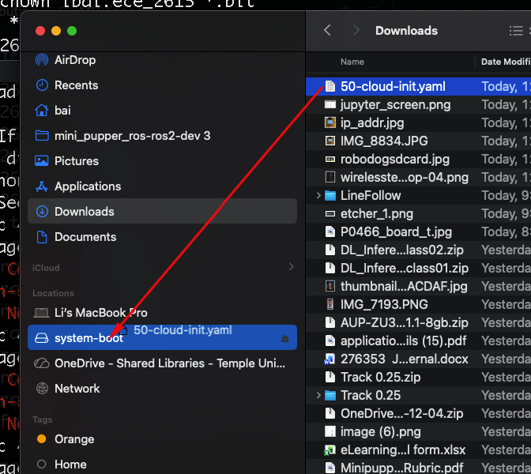
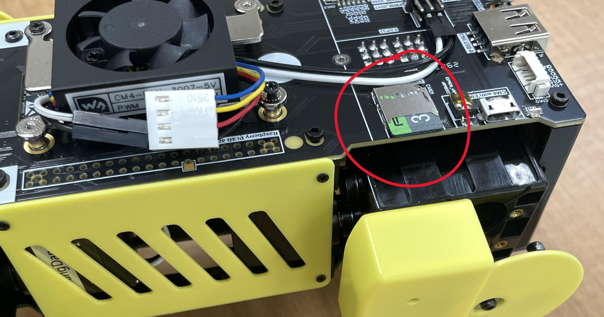
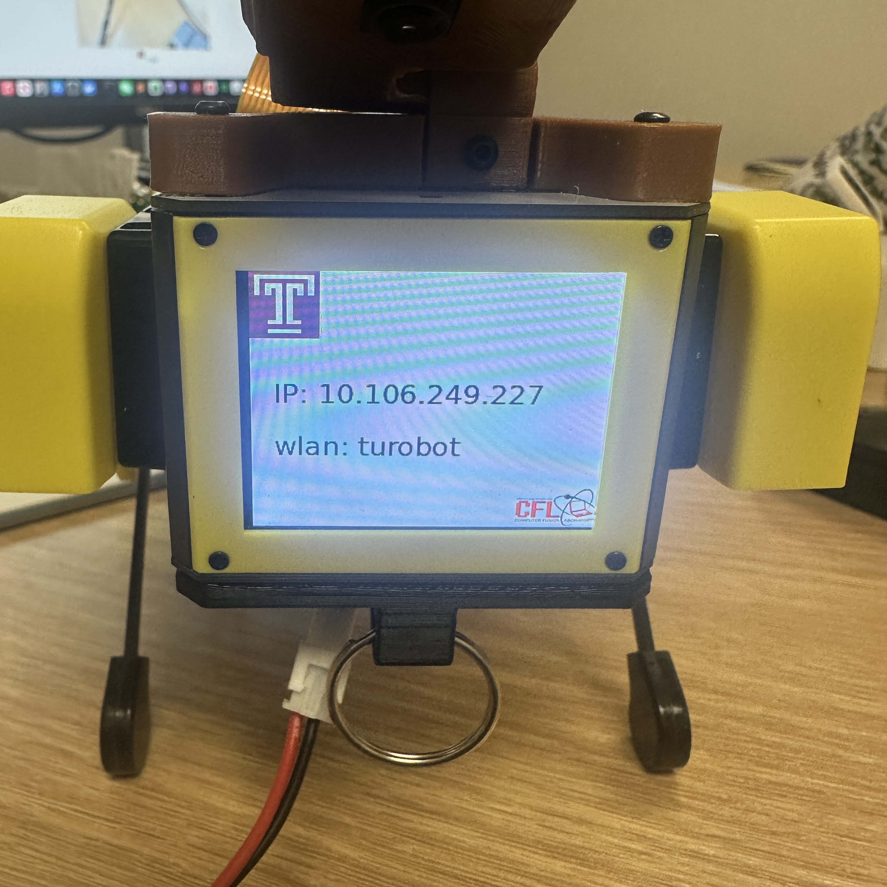
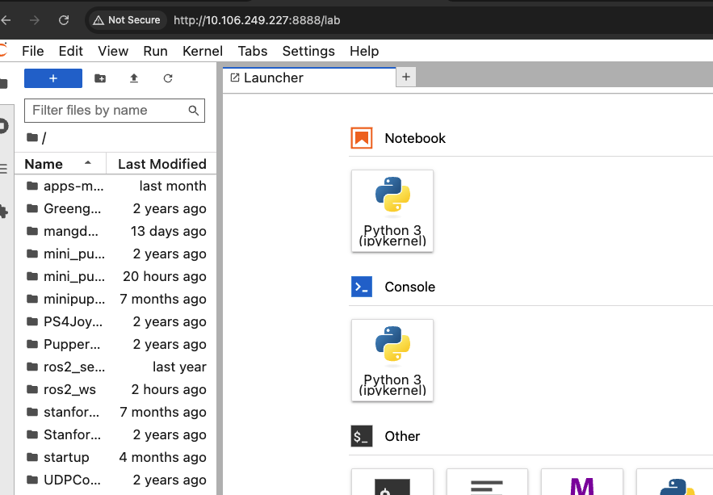

## Setup 

1. Download an [minipupper image](https://tuprd-my.sharepoint.com/:u:/g/personal/lbai_temple_edu/EYx-Jk2yPAFKrQ_8STaxqjwBiD1HJw8GQMWIcMAq6t8KRQ?e=yvpdk1)
2. Download and install [Balena Etcher](https://etcher.balena.io/) 
   
   
4. Create a login credential on [this link](https://bit.ly/pihash) (please right-click and open in a new tab), then download `50-cloud-init.yaml` after you add your WiFi credentials.

5. copy the file to the microSD Card drive 
   

6. eject the microSD card, and out it in the robot dog sd card slot 
    

7. power the robot dog until you hear the robot makes a sound, then unplug power and replug in again. You should be able to see the IP address on the robot dog 
    
   
8. Open a browser, type http://[ip_address]:8888 (e.g. http://10.106.249.227:8888), password: mangdang to login the minipupper 

